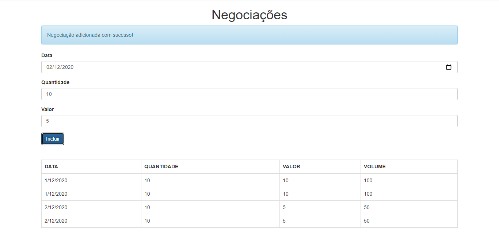

# AluraBank

Projeto de estudo do curso 01 de typescript da Alura.

## Baixe as dependências do projeto

```bash
npm install
```

## Execute o compilador do typescript

```bash
npm start
```
## Visualização

Para vizualizar a aplicação basta abrir o arquivo index.html no browser.


